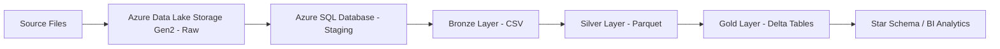

# Retail Electronics Sales Data Engineering Pipeline


## Project Overview

This project demonstrates an **end-to-end modern data engineering pipeline** for processing Retail Electronics Sales data using the **Medallion Architecture (Bronze → Silver → Gold)**.

The pipeline ingests raw sales data, performs incremental loading, applies data validation and transformation, and builds a **Star Schema data model** for analytical reporting.

Pipeline orchestration is handled using **Azure Data Factory**, while data processing and transformations are implemented in **Azure Databricks**.

---

# Architecture Overview



---

# Technologies Used

- **Azure Data Factory** – Pipeline orchestration  
- **Azure Data Lake Storage Gen2** – Data lake storage  
- **Azure Databricks** – Data transformation and processing  
- **Azure SQL Database** – Staging and watermark tracking  
- **Delta Lake** – Gold layer storage  
- **PySpark** – Distributed data processing  
- **Git** – Version control  
- **CI/CD Pipelines** – Automated deployment  

---

# Data Pipeline Workflow

The pipeline executes the following steps:

### 1. Source Data Ingestion
Retail Electronics Sales data is uploaded into **Azure Data Lake Storage Gen2** as raw files containing:

- Customer details
- Product details
- Store information
- Transaction date
- Sales amount

---

### 2. Incremental Load Detection

Two **Lookup activities** in Azure Data Factory detect new data:

**Lookup – Last Load**

Retrieves the last processed timestamp from the watermark table stored in Azure SQL Database.

**Lookup – Current Load**

Determines the latest timestamp available in the source data.

Only records between these timestamps are processed.

---

### 3. Incremental Data Load

A **Copy Data activity** loads incremental data.

**Source**

ADLS Gen2 Raw Files

**Destination**

Azure SQL Database staging table

Only records between:

```
LastLoadTimestamp
CurrentLoadTimestamp
```

are copied.

---

### 4. Watermark Update

A **Stored Procedure activity** updates the watermark table in Azure SQL Database after successful ingestion.

This ensures the pipeline processes only new records in the next execution.

---

# Medallion Architecture

The pipeline follows the **Medallion Architecture** pattern.

| Layer | Format | Purpose |
|------|------|------|
| Bronze | CSV | Raw data ingestion |
| Silver | Parquet | Cleaned and validated data |
| Gold | Delta | Business-ready analytical data |

---

# Bronze Layer

The **Bronze layer** stores raw data ingested from the source system.

### Characteristics

- Minimal transformations
- Raw historical storage
- Stored in CSV format
- Preserves original data structure

### Source

ADLS Gen2 raw files

### Sink

Bronze container in Data Lake

---

# Silver Layer

The **Silver layer** performs data cleansing and transformation.

### Source

Bronze Layer → Raw CSV files

### Data Quality Checks

| Validation Rule | Description |
|---|---|
| Unit_Price > 0 | Ensures product price is valid |
| Units_Sold > 0 | Ensures quantity sold is valid |
| Discount_Percent between 0 and 100 | Ensures discount values are realistic |

Duplicate records are removed using **Order_ID**.

---

### Invalid Data Handling

Records failing validation rules are written to a **quarantine location**.

```
/silver/quarantine/
```

This allows investigation of data issues without affecting analytics.

---

### Data Transformations

After validation, the following transformations are applied:

| Column | Description |
|---|---|
| Gross_Revenue | Unit_Price × Units_Sold |
| Discount_Amount | Gross_Revenue × Discount_Percent |
| Total_Revenue | Gross_Revenue − Discount_Amount |

Numeric columns are standardized by rounding to two decimal places.

---

### Output

Cleaned data is written to the Silver layer in **Parquet format**.

```
/silver/clean/
```

---

# Gold Layer

The **Gold layer** contains business-ready analytical tables built using a **Star Schema**.

```
gold_layer
├── dim_customer
├── dim_products
├── dim_store
├── dim_date
└── fact_sales
```

Tables are stored using **Delta format**.

---

# Dimension Tables

## dim_customer

Source: Silver Layer

Transformations:

- Extract customer attributes
- Remove duplicates
- Compare with existing dimension table
- Generate surrogate keys
- Apply **SCD Type 1** updates

Sink:

```
gold/dim_customer
```

---

## dim_products

Source: Silver Layer

Transformations:

- Extract product attributes
- Remove duplicate records
- Generate surrogate keys
- Apply SCD Type 1 logic

Sink:

```
gold/dim_products
```

---

## dim_store

Source: Silver Layer

Transformations:

- Extract store attributes
- Identify new and existing stores
- Generate surrogate keys
- Apply SCD Type 1 merge logic

Sink:

```
gold/dim_store
```

---

## dim_date

Source:

Transaction date from Silver dataset

Transformations:

- Extract Year, Month, Quarter, Day
- Generate surrogate key
- Create calendar attributes

Sink:

```
gold/dim_date
```

---

# Fact Table

## fact_sales

Source: Silver Layer dataset

### Transformations

- Join with dimension tables:
  - dim_customer
  - dim_products
  - dim_store
  - dim_date
- Replace business keys with surrogate keys
- Generate analytical measures

### Example Measures

- Sales Amount
- Quantity
- Revenue

Sink:

```
gold/fact_sales
```

---

# Slowly Changing Dimension (SCD Type 1)

Dimension tables use **SCD Type 1** logic.

Characteristics:

- Existing records are overwritten
- No historical tracking
- Only the latest value is stored

Example:

If a product price changes, the old value is replaced with the new value.

---

# Azure Data Factory Pipeline Flow

```
Lookup Last Load
      ↓
Lookup Current Load
      ↓
Copy Incremental Data
      ↓
Update Watermark
      ↓
Bronze Notebook
      ↓
Silver Notebook
      ↓
Dimension Notebooks
      ↓
Fact Sales Notebook
```

---
